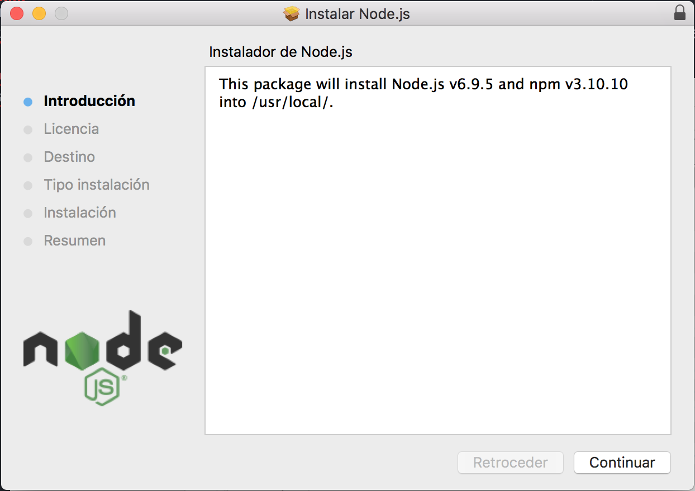
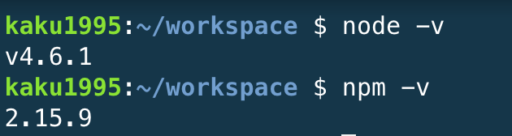

# Node Js
## Introducción.

Node.Js es un entorno de ejecución de java basado en el motor de JavaScript V8 de Chrome.
Node.Js utiliza como manipulador de paquetes por defecto npm, poseyendo grandes librerías de codigo abierto a su disposición.

## Instalación.

Para su instalación es necesario descargar el instalador en su propia [página](https://nodejs.org/es/) y seguir las instrucciónes que se van indicando.

En caso de utilizar plataformas como c9, el nodejs ya vendrá preinstalado y podemos comprobar su versión:

   
