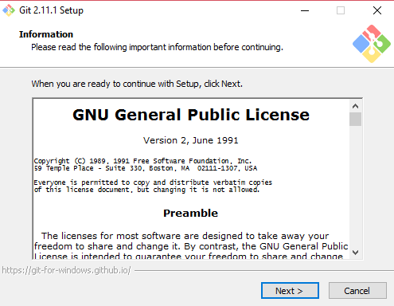
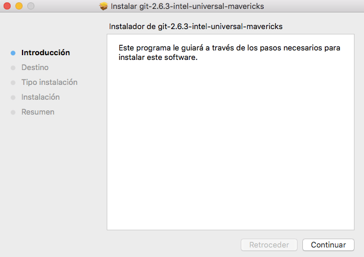

# Git
## Introducción

Git es un softare de control de versiones. Nos permit crear y mantener un control de versiones de un proyecto o aplicación.
Facilita un desarrollo no lineal, eficiente y ordenado, con gestión de ramas y su mezclado.

## Instalación.

Podemos instalar git en varios sistemas operativos como:

### Windows:
En este [enlace](https://sourceforge.net/projects/git-osx-installer/files/git-2.10.1-intel-universal-mavericks.dmg/download?use_mirror=autoselect) podemos acceder a la descarga del instalador de git para mac. Al descargarlo, la instalación en el pc será algo como esto:

### Mac:
En este [enlace](https://sourceforge.net/projects/git-osx-installer/files/git-2.10.1-intel-universal-mavericks.dmg/download?use_mirror=autoselect) podemos acceder a la descarga del instalador de git para mac. Al descargarlo, la instalación en el pc será algo como esto:

### Linux:
Para instalar git en linux, podemos hacerlo mendiante la terminal con el comando: apt-get install git

## Uso Básico

